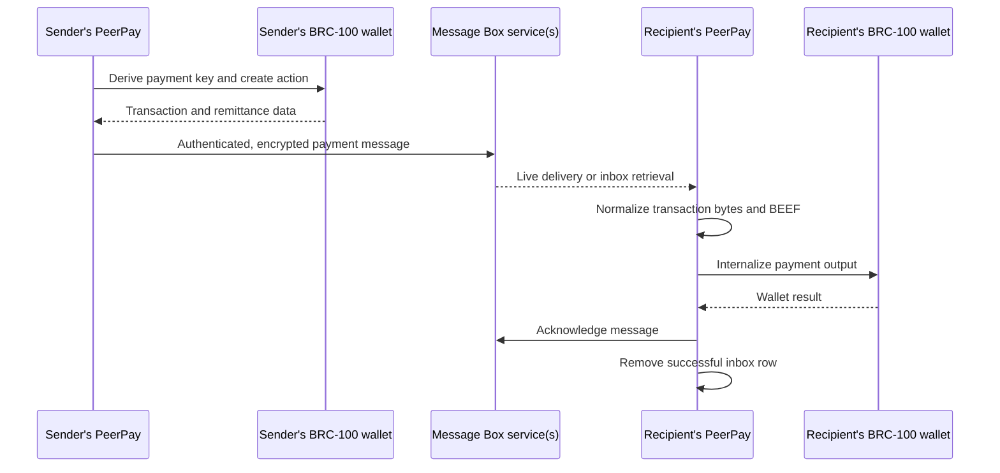

# PeerPay

**Learn to build identity-addressed Bitcoin SV payments with a browser app and a BRC-100 wallet.**

PeerPay is a working React application for sending, receiving, accepting, and rejecting BSV payments. It demonstrates how to compose a wallet interface, identity discovery, encrypted Message Box delivery, and transaction proofs without running an application-specific backend. Babbage operates the [hosted app](https://peerpay.metanet.app/); compatible wallet implementations provide the wallet interface.

This repository contains an application, not a published React component package. Clone it to run or study it. The payment client is `PeerPayClient` from **`@bsv/message-box-client`**. Both package manifests in this repository are private.

## Start here

| Your goal | Start with |
| --- | --- |
| Run the application locally | [Quick start](#quick-start) |
| Demonstrate a complete payment | [Two-wallet demo](docs/demo.md) |
| Understand who does what | [Architecture and source map](docs/architecture.md) |
| Learn identity, trust, and contacts | [Identity and contacts](docs/concepts/identity-and-contacts.md) |
| Understand the other protocols | [Concept guide and glossary](docs/README.md) |
| Reuse the patterns in another app | [Builder lab](docs/builder-lab.md) |
| Diagnose a failed demo | [Troubleshooting](docs/troubleshooting.md) |
| Build, host, or contribute | [Development and deployment](docs/development.md), [contributing](CONTRIBUTING.md) |

## What you can learn

- **Wallet delegation:** request transactions and cryptography through BRC-100 while the wallet controls keys, permissions, funding, and transaction processing.
- **Identity and trust:** distinguish an identity key, a certified attribute, and a local contact name; resolve a recipient without making a payment address the user interface.
- **Identity-addressed payments:** select a recipient by identity, contact, or QR, then let BRC-29 remittance derive the payment output.
- **Asynchronous delivery:** combine an initial inbox fetch with live messages, and distinguish delivery from wallet acceptance.
- **Portable transactions:** validate byte representations and normalize legacy BEEF into AtomicBEEF at a compatibility boundary.
- **Wallet-backed application data:** save encrypted contacts using wallet outputs and baskets instead of a PeerPay user database.
- **Resilient UI:** preserve failed inbox rows, process bulk acceptance sequentially, use integer satoshis, and report bounded operational telemetry.

PeerPay does not implement a wallet, Message Box server, certificate issuer, or overlay service. It consumes those capabilities. Its “Recently Sent” list holds the last five sends in memory; it is not a durable payment ledger. There is no invoice, request-payment, fiat-conversion, or confirmation-tracking UI.

## Quick start

Use **Node.js 22.12 or later in the Node 22 line** and npm. CI uses Node 22; the locked Vite version requires at least 22.12 on that line. For payment operations you also need an unlocked, funded BRC-100 wallet reachable by `WalletClient` from the browser or wallet-hosted WebView. Two separate wallet identities make the demo meaningful.

```sh
git clone https://github.com/p2ppsr/peerpay.git
cd peerpay/frontend
npm ci
npm run dev
```

Open **http://localhost:5173** in your wallet-compatible browser environment. The dev server uses that exact port and fails if it is occupied. For example, Metanet Desktop/Mobile can host the app with a wallet bridge; a browser without a reachable wallet can render the UI but cannot complete the payment workflow. Follow your wallet's setup and permission prompts.

The frontend needs no `.env` file or private key in source. **Localhost is not a sandbox:** [constants.ts](frontend/src/utils/constants.ts) selects `https://messagebox.babbage.systems` for both local and production use, and the checked-in LARS/CARS configurations use mainnet. Opening the app initializes wallet/inbox activity and telemetry. Use dedicated demo wallets, a small agreed payment amount, and funds for any wallet/service fees. See [demo preparation](docs/demo.md#prepare-the-demo).

From `frontend/`, validate your checkout:

```sh
npm test
npx tsc --noEmit
npm run build
npx vite preview --host 127.0.0.1
```

The build is written to `frontend/build/`. Preview serves the built app, normally at http://127.0.0.1:4173. Origin changes can cause new wallet permission prompts. `npm run build` does not run TypeScript checking; run the separate command above.

The root package is for **LARS/CARS orchestration**. Root `npm start` starts LARS, and root `npm run build` invokes CARS. Neither is the frontend quick-start command. You do not need root dependencies, Docker, or deployment credentials to use Vite or the offline unit tests.

## How a payment moves



The client libraries perform most arrows; the React components orchestrate the user journey. “Payment sent” means the send call completed. It does not prove that the recipient accepted the output or that the transaction has a block confirmation. See [wallets and payments](docs/concepts/wallets-and-payments.md) and [messaging and overlays](docs/concepts/messaging-and-overlays.md).

### A short demo

1. Open PeerPay with two different wallet identities, Alice and Bob.
2. On Alice's side, select Bob through identity search, a saved contact, or **Scan QR**. Compare Bob's full identity key through a trusted channel.
3. Enter a positive whole number of satoshis and choose **Send Payment**. Approve the wallet operation.
4. On Bob's side, observe the incoming row and choose **Accept**. Confirm the wallet records the received output and the row is removed.
5. Reload both apps: wallet-backed data survives; Alice's in-memory recent-send list does not.

Use the [full demo script](docs/demo.md) for expected results, delayed delivery, contact/QR demonstrations, and how to handle ambiguous failures. **Reject is financially meaningful:** below 2,000 sats the current path acknowledges without a refund; at or above 2,000 sats it accepts first and sends back `amount - 1,000`. This policy and its failure boundaries are explained [here](docs/concepts/wallets-and-payments.md#reject-is-a-policy-not-an-undo).

## The concepts, with code to inspect

| Concept | Explanation | Application entry point |
| --- | --- | --- |
| BRC-100, wallet permissions, BabbageGo | [Wallets and payments](docs/concepts/wallets-and-payments.md) | [peerPayClient.ts](frontend/src/utils/peerPayClient.ts) |
| BRC-29, BRC-42/43, UTXOs, integer satoshis | [Wallets and payments](docs/concepts/wallets-and-payments.md) | [PaymentForm.tsx](frontend/src/components/PaymentForm.tsx) |
| Message Box, authentication, encryption, live delivery, overlays | [Messaging and overlays](docs/concepts/messaging-and-overlays.md) | [App.tsx](frontend/src/App.tsx) |
| Certificates, discovery, contacts, baskets, PushDrop, UHRP, QR | [Identity and contacts](docs/concepts/identity-and-contacts.md) | [ContactModal.tsx](frontend/src/components/ContactModal.tsx) |
| BEEF, AtomicBEEF, SPV, byte serialization | [Transactions and bytes](docs/concepts/transactions-and-bytes.md) | [paymentTransaction.ts](frontend/src/utils/paymentTransaction.ts) |
| React state, deduplication, partial failures, telemetry | [Browser reliability](docs/concepts/browser-reliability.md) | [paymentCompatibility.ts](frontend/src/utils/paymentCompatibility.ts), [telemetry.ts](frontend/src/utils/telemetry.ts) |
| Vite, TypeScript, npm lockfiles, LARS and CARS | [Development and deployment](docs/development.md) | [deployment-info.json](deployment-info.json) |

## Repository layout

```text
README.md                  Builder entry point
docs/                      Explanations, demos, exercises, troubleshooting
frontend/
  src/App.tsx              Inbox, live listener, bulk acceptance, recent sends
  src/components/          Payment, identity/contact, QR, and amount UI
  src/utils/               Client composition, compatibility, telemetry, audio
  package-lock.json        Reproducible frontend dependencies
  vite.config.mjs          Dev server and build output
deployment-info.json       Frontend-only LARS/CARS configuration
.github/workflows/         Production CARS release automation
package-lock.json          Separate orchestration dependency lockfile
```

The documented baseline is frontend `0.1.57`, with SDK `2.6.0`, Message Box client `2.4.1`, and Identity React `1.1.14` resolved in the frontend lockfile. These are the repository's versions, not a claim about the newest published packages. Read the [version and dependency notes](docs/development.md#dependencies-and-validation) before upgrading.

## Reuse and contribution

Start with the [builder lab](docs/builder-lab.md): run offline transaction-format exercises, trace one payment, then adapt a small integration with explicit wallet and Message Box dependencies. Components in this app import a shared client; they are not independently packaged widgets. The [architecture guide](docs/architecture.md) documents their real props and coupling.

For changes, see [CONTRIBUTING.md](CONTRIBUTING.md). Include the browser/wallet environment, relevant package versions, and whether a report concerns discovery, delivery, internalization, or acknowledgement. Never include private keys, seed words, payment payloads, or unredacted wallet logs in issues.

### License status

The previous frontend README named the Open BSV License, but this checkout contains no repository license file and neither private package manifest declares a license. Ask the maintainers to provide the authoritative terms before redistributing or incorporating the code. Dependencies have their own licenses. This documentation does not add or infer a license grant.
