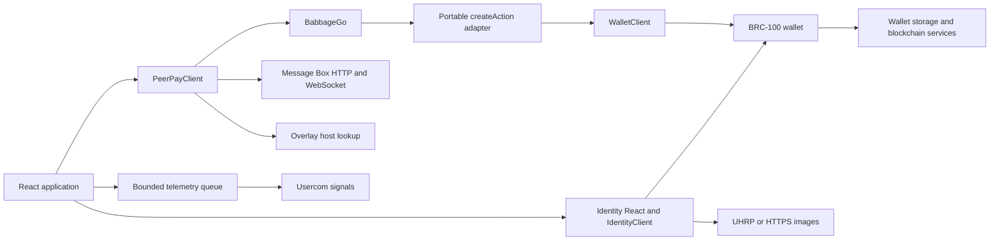

# Architecture and source map

[Back to the builder guide](README.md)

## Responsibility boundaries

Static hosting delivers HTML, CSS, and JavaScript. It does not keep PeerPay account balances or sign customer payments. Wallet and external service availability remain necessary even when the page loads successfully.

| Layer | Owns | Does not establish |
| --- | --- | --- |
| React app | Input, selection, pending rows, feedback, local normalization | Spend authority or durable financial records |
| BRC-100 wallet | Keys, permissions, actions, internalization, wallet data | Whether a displayed contact name is the person you intended |
| Message Box client/server | Message encryption/routing, queue/listen/acknowledge | Recipient acceptance or block confirmation merely from delivery |
| Identity/overlay facilities | Discovery and indexed claims/host records | Universal trust in all results or availability of every host |
| CARS/static hosting | Application assets and release delivery | A working wallet bridge in every browser |

## Follow the code

| File | Read it for |
| --- | --- |
| [main.tsx](../frontend/src/main.tsx) | React 18 root, theme, Toastify, audio setup, telemetry, error boundary. |
| [App.tsx](../frontend/src/App.tsx) | Initial inbox fetch, listener startup, duplicate suppression, recent sends, sequential Accept All. |
| [peerPayClient.ts](../frontend/src/utils/peerPayClient.ts) | Shared wallet adapter → BabbageGo → PeerPayClient composition. |
| [constants.ts](../frontend/src/utils/constants.ts) | Message Box host selection. |
| [PaymentForm.tsx](../frontend/src/components/PaymentForm.tsx) | Recipient selection, integer amount validation, `sendLivePayment`. |
| [PaymentList.tsx](../frontend/src/components/PaymentList.tsx) | Pending row actions and per-message processing state. |
| [paymentCompatibility.ts](../frontend/src/utils/paymentCompatibility.ts) | Prepare/accept/reject boundary and acceptance-result check. |
| [paymentTransaction.ts](../frontend/src/utils/paymentTransaction.ts) | AtomicBEEF parsing and legacy conversion. |
| [walletCompatibility.ts](../frontend/src/utils/walletCompatibility.ts), [byteArrayCompatibility.ts](../frontend/src/utils/byteArrayCompatibility.ts) | Portable outgoing bytes and strict byte-shape recognition. |
| [ContactModal.tsx](../frontend/src/components/ContactModal.tsx), [ContactSelector.tsx](../frontend/src/components/ContactSelector.tsx) | Save/read/remove wallet-backed contacts and local filtering. |
| [QRScanner.tsx](../frontend/src/components/QRScanner.tsx), [qrUtils.ts](../frontend/src/utils/qrUtils.ts) | Camera lifecycle, QR extraction, optional generation helpers. |
| [SatoshiInput.tsx](../frontend/src/components/SatoshiInput.tsx), [SatoshiAmount.tsx](../frontend/src/components/SatoshiAmount.tsx) | Amount parsing and formatting without exchange-rate requests. |
| [telemetry.ts](../frontend/src/utils/telemetry.ts) | Sanitization, local queue, retries, lifecycle/error reporting. |
| [theme.ts](../frontend/src/theme.ts), [App.scss](../frontend/src/App.scss), [sfx.ts](../frontend/src/utils/sfx.ts) | MUI/Emotion styling, responsive layout, synthesized audio feedback. |

## Actual component contracts

These components are source modules, not an exported npm API.

| Component | Inputs/callbacks | Coupling |
| --- | --- | --- |
| `PaymentForm` | `onSend(amount: number, recipient: string)` | Calls the shared client; callback runs after send resolves. |
| `PaymentList` | `payments?`, `onUpdatePayments(messageId: string)`, `isBulkAccepting?` | Calls compatibility helpers; callback identifies a successful row for removal. |
| `RecentlySentList` | `payments: SentPayment[]` | Displays parent-owned in-memory history. |
| `ContactModal` | `open`, `onClose`, `onContactSelected`, `openMode?` | Own `IdentityClient`; mode is `contacts` or `scan`. |
| `ContactSelector` | `onContactSelected`, `selectedContactKey?`, `searchQuery?` | Own `IdentityClient`; loads contacts and filters them locally. |
| `QRScanner` | `isOpen`, `onScan(data: string)`, `onClose` | Browser camera and `qr-scanner`. |
| `SatoshiInput` | `onSatoshisChange(number \| null)` | Own text state; invalid/empty input yields `null`. |
| `SatoshiAmount` | `amount: number` | Pure formatting for nonnegative safe integers. |

Contact clients and identity components use their default wallet integration; they do not receive the `babbageGo` instance from the payment singleton. If you introduce dependency injection or wallet switching, wire **both** payment and identity paths deliberately.

## Where data lives

| Data | Location and lifetime |
| --- | --- |
| Keys, spendable outputs, transaction history | The wallet and its configured storage/services. |
| Encrypted contacts | Wallet-managed contact outputs, plus SDK in-memory caches. |
| Pending payment envelopes | Message Box queue until acknowledgement, plus the current React inbox. |
| Selected recipient, form, processing indicators | Current component state. |
| Last five sends | `App` state only; reset on page reload. |
| Telemetry ID and pending events | This origin's localStorage when available, then the telemetry service. |

Reload rebuilds the inbox from the service and drops ephemeral display state. It does not reset the wallet or refund payments.

## What is outside this application

There is no PeerPay backend directory, database schema, custom topic manager, or custom lookup service. The deployment manifest's `topicManagers` and `lookupServices` are empty. Payment requests and other APIs present in the client library are not automatically application features. Extending the app requires UI, policy, persistence, and validation work for those features.
