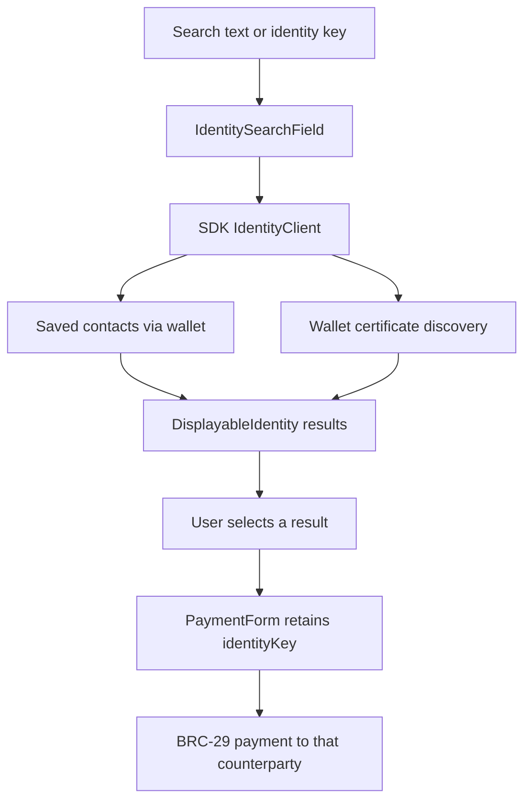

# Identity, certificates, trust, and contacts

[Back to concepts](../README.md)

Identity is central to PeerPay: the application sends to a participant identified by a public key, while giving people several ways to recognize and select that participant. The name shown on a card, the key used for addressing, the evidence behind a badge, and the payment output are different things.

## Four questions to keep separate

| Question | Mechanism | Example |
| --- | --- | --- |
| Which cryptographic participant is this? | Identity public key and proofs made through its wallet | Bob's wallet controls the private key corresponding to the selected identity. |
| What does someone claim about that participant? | Certificate issued by a certifier | A certifier attests an email address or social account belongs with a subject key. |
| Do I trust that claim for this purpose? | Wallet/user trust policy and application presentation | Alice recognizes the certifier and decides the claim is sufficient to identify her intended Bob. |
| What do I call this person locally? | Saved contact metadata | Alice labels that same key “Bob — workshop.” |

A recognizable name is not globally unique. A locally assigned contact name is not a certificate. A signature proves a relationship to a key; it does not by itself establish that every real-world assertion is true. PeerPay does not implement its own account registry or universal trust policy.

## Certificates and selective disclosure

[BRC-52](https://github.com/bsv-blockchain/BRCs/blob/master/peer-to-peer/0052.md) defines certificates binding fields to a subject identity under a certifier's signature, with field encryption and selective disclosure machinery. A recipient can learn the disclosed fields without requiring every field to be public. Disclosure, certificate verification, revocation handling, and trust decisions belong in the appropriate wallet/identity facilities.

PeerPay consumes displayable identities; it does not issue certificates or expose a certificate acquisition/revocation screen. Its identity components use SDK results to display a name, avatar, abbreviated key, and certifier badge where available. These fields are presentation data, not a new proof generated by the React card.

[BRC-68](https://github.com/bsv-blockchain/BRCs/blob/master/peer-to-peer/0068.md) describes publishing trust-anchor details at a domain's manifest. It helps connect a known domain with a certifier's key and descriptive metadata. It is not the identity search protocol, and merely retrieving a manifest does not require the user to trust that certifier. PeerPay itself does not configure trust anchors; inspect the wallet's identity/trust settings when search results differ between environments.

## The public discovery path in this app

[PaymentForm.tsx](../../frontend/src/components/PaymentForm.tsx) mounts `IdentitySearchField` from `@bsv/identity-react`. With the locked Identity React `1.1.14`, its lookup utility calls either `IdentityClient.resolveByIdentityKey(..., true)` or `resolveByAttributes({ attributes: { any: query } }, true)`. The boolean enables contact participation. The wallet's underlying discovery methods return certificates; the SDK turns them into displayable identities. The component debounces and caches searches and guards against stale asynchronous results.

Selection returns a `DisplayableIdentity`. PeerPay retains that object for the recipient card but passes **its `identityKey`** to `sendLivePayment`; it does not pay to the displayed email, avatar URL, or nickname. Incoming and recent-payment lists render `IdentityCard` for the sender/recipient key.

### Discovery has version-specific limits

In the locked SDK `2.6.0`, the contact-inclusive path can fail when loading contacts fails. Its contact matching for attribute queries does not treat the `any` field as a search across contact names. Identity React `1.1.14` catches search failures and sets an empty results list. Consequently, “no results” can reflect permissions/service failure or query behavior, not just the absence of a person.

The **Select Contact** modal uses a separate path: it calls `getContacts()` and filters the returned list locally by name, identity key, and abbreviated key. A contact may be selectable there even when public search does not find its nickname. A local name is not published as a public discovery attribute simply because it was saved.

These statements describe the checked-in lockfile. Updating the installed wallet alone does not replace the SDK bundled in PeerPay's JavaScript. Qualify dependency upgrades with both public identities and contact-only names, including permission/error cases.

## Contacts as wallet-backed application data

[ContactModal.tsx](../../frontend/src/components/ContactModal.tsx) builds a `DisplayableIdentity` and calls `IdentityClient.saveContact`. [ContactSelector.tsx](../../frontend/src/components/ContactSelector.tsx) reads and removes contacts with `getContacts` and `removeContact`.

In the resolved SDK, `ContactsManager` uses the `contacts` output basket and protocol ID `[2, 'contact']`. It encrypts the contact record for the wallet itself, stores data using a PushDrop locking script, and uses HMAC-derived identity tags for lookup. `customInstructions` retain the key ID needed to decrypt the record. The in-memory cache speeds reads; the durable record belongs to wallet-managed outputs.

Three reusable ideas are working together:

- **Baskets** organize outputs by application meaning; they are wallet bookkeeping, not separate blockchains.
- **PushDrop** associates data with an output while allowing that output to be spent under its locking conditions.
- **Wallet encryption and HMAC indexing** protect record contents and avoid using a plain identity key as the lookup tag.

Saving, updating, or removing a contact can involve wallet actions, permissions, and fees. It is not just a browser-local JSON write. Removal changes the active wallet record; it does not erase historical blockchain bytes. Read [BRC-46](https://github.com/bsv-blockchain/BRCs/blob/master/wallet/0046.md) and [BRC-48](https://github.com/bsv-blockchain/BRCs/blob/master/scripts/0048.md) alongside the installed `ContactsManager` implementation.

## UHRP: identity media without one permanent storage URL

Identity React uses [UHRP React](https://github.com/bsv-blockchain/uhrp-react) image components. UHRP addresses content by hash and resolves available hosting locations; a content hash identifies bytes rather than trusting one URL to always serve the same image. This supports portable identity media, but an avatar image is still not proof of a person's identity.

PeerPay has no media-upload flow. Its own contact/selected-recipient cards use MUI `Avatar` with `src={avatarURL}`, while the library's identity cards/search results use UHRP-aware image handling. Do not assume every image surface has identical URL-resolution behavior. A missing avatar does not necessarily prevent payment to a known key.

## QR is a transport for a key

[qrUtils.ts](../../frontend/src/utils/qrUtils.ts) can generate a raw-key QR or a JSON object with `type: 'identity'`, `identityKey`, and `timestamp`. Its parser recognizes those forms and several common key-property aliases. The timestamp is metadata; there is no signed expiry or payment request encoded by these helpers.

The main **Scan QR** button selects a recipient without saving a contact. The scanner inside **Add New Contact** fills the key field so the user can save it. Generation helpers exist in source, but the current UI does not have a “Show my QR” screen; use the wallet's identity QR or a builder-added display.

The parser is permissive extraction, not cryptographic verification. Contact entry checks a compressed-key text pattern; the send form checks key length. These UI checks do not form a complete public-key or identity validation layer. For a new integration, parse the extracted key with SDK primitives, preserve the full key for confirmation, and apply one consistent validation policy before any wallet operation. A correctly formatted QR still does not establish who presented it.

## Demonstrate identity before moving money

In the [demo](../demo.md), compare three ways of selecting the same recipient: public discovery, a local contact alias, and the recipient's QR. Confirm the full key stays the same while names/badges differ. Explain the source of each label and claim, then send the small agreed payment. This demonstrates the useful separation between human recognition, cryptographic identity, and settlement. For broader application design, read [BRC-189: Identity, Certificates, Discovery, and Personal Trust in Applications](https://github.com/bsv-blockchain/BRCs/blob/master/wallet/0189.md); its newer guidance is not a claim that this app implements every described capability.
